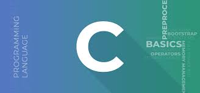

# My C Track Progress on Exercism

## Introduction

Welcome to my journey of mastering the C programming language through Exercism! As a seasoned programmer, I've decided to revisit this powerful language and enhance my C skills further.

## Why C?

C has been the backbone of programming for decades, and its simplicity and efficiency continue to make it relevant even today. Understanding C allows me to dive deep into low-level programming, memory management, and systems-level development, providing a strong foundation for my programming expertise.

## Learning Path

With Exercism's C track, I plan to follow a step-by-step learning path to challenge myself and solidify my understanding of C concepts. Starting from basic exercises, I aim to progress towards more complex problems, honing my problem-solving abilities along the way.

## My Commitment

I am committed to dedicating time daily to work on C exercises and submitting my solutions for feedback. As I explore each problem, I will take a creative approach to implement efficient solutions, striving for elegance and clarity in my code.

## Join Me!

If you are also on the C track or wish to embark on this journey together, join me on Exercism! Let's collaborate, exchange ideas, and support each other in our pursuit of C proficiency.

---
*I am an avid learner, passionate about mastering the C programming language. I believe that continuous practice and learning from the Exercism community will unlock new horizons for my coding abilities. Together, let's explore the depth and beauty of C programming!* 
