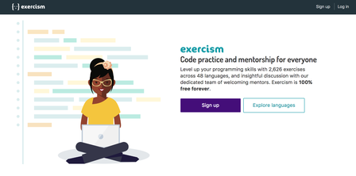
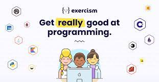

# Exercism_23

# Exercism - Building Language Skills with Real-World Coding Practice

## Introduction

Welcome to Exercism - your go-to platform for enhancing your language skills through practical coding exercises and real-world mentorship. Whether you're a seasoned programmer or just getting started, Exercism offers a wide range of programming language tracks to challenge and elevate your coding abilities.

## History

Exercism was born out of a passion for empowering learners to excel in programming. Developed by the talented software developer, Katrina Owen, while teaching programming at Jumpstart Labs, Exercism initially served as an internal tool to provide her students with much-needed feedback on their coding practice. Its success was immediate and undeniable, as learners started sharing the platform with their peers, collaborating on exercises, and providing valuable feedback to each other.

Within just a year, Exercism grew organically to cater to over 6,000 users, with hundreds of volunteers contributing to the languages and tooling offered on the platform.

## Explore the World of Coding

At Exercism, we believe in hands-on, immersive learning. Unlike traditional coding platforms, we encourage you to dive in and solve coding exercises right on your computer. Our command-line client allows you to download exercises, work on them offline, and submit your solutions for personalized feedback. Furthermore, you gain valuable insights by exploring other users' solutions to the same problems, fostering a community-driven learning environment.

## Diverse Language Tracks

With Exercism, you have access to an extensive selection of 66 programming languages, ranging from the widely-used Java, Python, and JavaScript to more specialized languages like Julia, Rust, and Kotlin. No matter which language you want to master, Exercism has a track tailored just for you.

Some of our popular language tracks include:
- C
- C++
- Java
- JavaScript
- Python
- Ruby
- Swift

Additionally, we are always expanding our offerings, and in 2023, we launched the "12 in 23" challenge, allowing you to learn the fundamentals of 12 different languages—one per month throughout the year.

## Open Source Community

At Exercism, we are committed to promoting open source development. Our codebase is available on GitHub, and we actively encourage contributions from programmers worldwide. With over 3,500 contributors and 11,500 mentors, Exercism thrives on the spirit of collaboration and knowledge-sharing.

Check out our open source repository on GitHub: [Exercism on GitHub](https://github.com/exercism/website)

## Join Us Today!

So, are you ready to embark on a journey of language mastery? Join Exercism today, and start your adventure of honing your coding skills, learning new languages, and connecting with a vibrant community of learners and mentors.

Happy coding, and let's make 2023 a year of boundless growth in the world of programming!

---
*I am an enthusiastic learner, actively working on various Exercism language tracks to broaden my programming horizons and deepen my understanding of different programming paradigms. Join me on this exhilarating learning path, and together, let's excel in the art of coding!*
